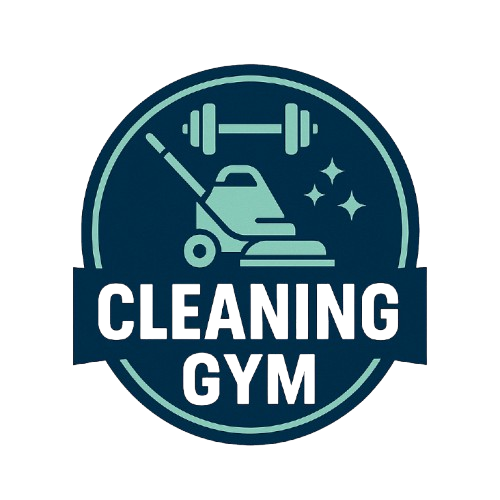

# 🏸 Cleaning Gym



> 체육관 회원들의 청소 당번 스케줄을 자동으로 생성하고 관리하는 웹 애플리케이션

## 📋 프로젝트 소개

Cleaning Gym은 체육관 청소 당번 스케줄을 공평하고 효율적으로 분배할 수 있도록 도와주는 도구입니다. 회원 목록을 기반으로 청소 스케줄표를 자동으로 생성하며, 각 회원의 레슨 일정을 고려하여 청소 당번 요일을 공평하게 배정합니다.

## ✨ 주요 기능

### 📊 회원 관리

- **통계 대시보드**: 총 회원수, 레슨 회원 통계표 제공
- **회원 등록**
  - 다이얼로그를 통한 개별 회원 추가
  - 엑셀 업로드를 통한 대용량 회원 일괄 등록
- **회원 정보 관리**: 수정, 삭제, 엑셀 다운로드

### 📅 청소 스케줄 관리

- **달력 UI**: 월별 청소 당번 달력 제공
- **드래그 앤 드롭**: 직관적인 스케줄 생성 및 수정
- **자동 배정**: 레슨 일정을 고려한 공평한 당번 분배
- **엑셀 내보내기**: 완성된 청소표 다운로드

## 🛠️ 기술 스택

- **Frontend**: Vue.js 3, TypeScript, Vuetify
- **Build Tool**: Vite
- **Deploy**: Vercel

## 🚀 시작하기

```bash
# 1. 저장소 클론
git clone https://github.com/HoonDongKang/gym-cleaning-rotation.git
cd cleaning-gym

# 2. 의존성 설치
npm install

# 3. 개발 서버 실행
npm run dev
```

## 💡 사용 방법

### 1️⃣ 회원 관리

#### 회원 목록 조회

통계 대시보드와 회원 리스트를 한눈에 확인할 수 있습니다.


#### 회원 추가 방법

**🔹 수동 추가**

다이얼로그에서 회원명과 레슨 여부를 선택하여 개별 추가

**🔹 엑셀 업로드**

1. `양식 다운로드` 버튼으로 템플릿 다운로드
2. 엑셀 파일에 회원 정보 입력
3. 완성된 파일 업로드하여 일괄 등록

**엑셀 양식 예시**
| 회원명 | 월/수 레슨 | 화/목 레슨 |
|--------|-----------|-----------|
| 홍길동 | O | X |
| 김철수 | X | O |
| 이영희 | O | O |

#### 회원 관리 기능

- **수정/삭제**: 다이얼로그를 통한 회원 정보 편집
- **목록 다운로드**: `${YYYY}${MM}${DD}_회원목록.xlsx` 형식으로 엑셀 다운로드

### 2️⃣ 청소 스케줄

#### 스케줄 생성

- **달 지정**: 현재 월을 기본으로 원하는 달 선택
- **자동 생성**: 회원 목록 기반으로 공평한 당번 자동 배정

#### 스케줄 편집

- **드래그로 생성**: 원하는 날짜나 기간을 드래그하여 새 스케줄 생성
- **클릭으로 삭제**: 생성된 스케줄을 클릭하여 삭제
- **드래그로 이동**: 스케줄을 다른 날짜로 드래그하여 수정

#### 스케줄 내보내기

- **파일명**: `${MM}월_청소표.xlsx`
- **양식**:
  | 날짜 | 요일 | 청소 담당자 |
  |------|------|-------------|
  | 2025-06-02 | 월 | 회원1, 회원2 |
  | 2025-06-03 | 화 | 회원3, 회원4 |

## ⚡ 스케줄 배정 규칙

### 📋 기본 규칙

1. **청소 요일**: 월, 화, 수, 목요일만 진행
2. **최소 참여**: 모든 회원 월 1회 이상 청소 참여
3. **레슨 고려**:
   - 월/수 레슨 회원 → 월/수요일 우선 배정
   - 화/목 레슨 회원 → 화/목요일 우선 배정

### 🔄 배정 알고리즘

1. 해당 월의 `[월/수]`, `[화/목]` 청소 일자 분류
2. 회원을 `[레슨X]`, `[모든 레슨]`, `[월/수 레슨]`, `[화/목 레슨]`으로 구분
3. 레슨별 회원을 해당 요일에 우선 배정
4. 모든 레슨 회원은 배정 인원이 적은 요일부터 분배
5. 레슨 미참여 회원을 전체 일자에 고르게 분배

## 📁 프로젝트 구조

```
cleaning-gym/
├── src/
│   ├── assets/           # 이미지, 정적 리소스
│   ├── components/       # 재사용 컴포넌트
│   │   ├── members/      # 회원 관리 컴포넌트
│   │   └── schedules/    # 스케줄 관리 컴포넌트
│   ├── router/           # 라우팅 설정
│   ├── types/            # TypeScript 타입 정의
│   ├── utils/            # 유틸리티 함수
│   └── views/            # 페이지 컴포넌트
├── vercel.json           # Vercel 배포 설정
└── package.json          # 프로젝트 설정
```

## 📝 관련 아티클

**[[Cleaning Gym] 제작기 근데 AI를 곁들인](https://velog.io/@d159123/Cleaning-Gym-%EC%A0%9C%EC%9E%91%EA%B8%B0-%EA%B7%BC%EB%8D%B0-AI%EB%A5%BC-%EA%B3%81%EB%93%A4%EC%9D%B8)**

프로젝트 개발 과정에서 AI를 활용한 경험과 인사이트를 공유합니다.

---
